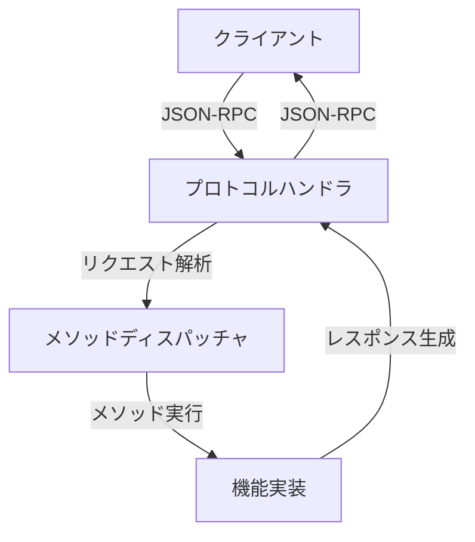
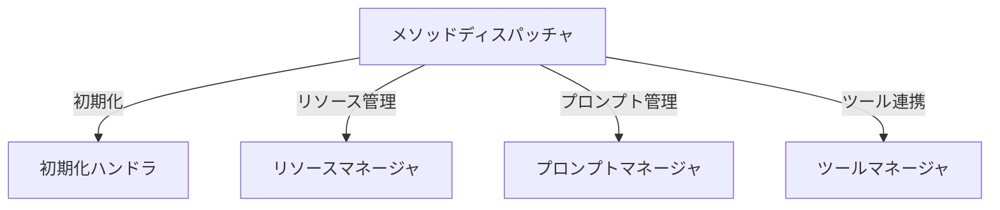
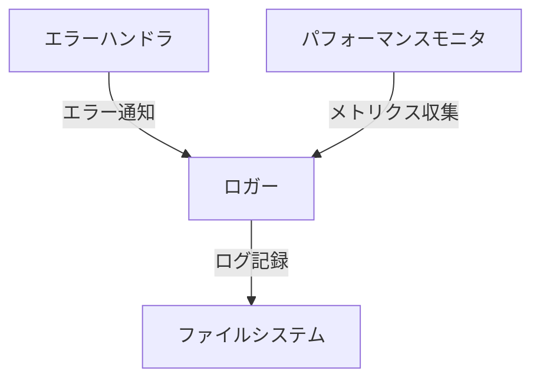

# MCPサーバーのアーキテクチャ解析

## はじめに

MCPサーバーの実装を進める中で、その全体像をより深く理解する必要を感じました。この記事では、MCPサーバーのアーキテクチャを体系的に分析し、主要なコンポーネントとその関係性について整理します。

## 分析の目的

1. **アーキテクチャの理解**
   - 主要コンポーネントの特定
   - コンポーネント間の関係性の把握
   - 設計思想の理解

2. **実装の指針**
   - ベストプラクティスの抽出
   - 拡張性の考慮点
   - パフォーマンスの最適化ポイント

3. **学習の体系化**
   - 知識の構造化
   - 実装の優先順位付け
   - 今後の学習計画の策定

## 主要コンポーネント

### 1. プロトコル層



- **役割**
  - JSON-RPCプロトコルの実装
  - リクエスト/レスポンスの形式管理
  - エラーハンドリング

- **主要クラス**
  - `ProtocolHandler`
  - `RequestParser`
  - `ResponseBuilder`

### 2. 機能層



- **役割**
  - 各機能の実装
  - 状態管理
  - リソース制御

- **主要クラス**
  - `InitializeHandler`
  - `ResourceManager`
  - `PromptManager`
  - `ToolManager`

### 3. インフラ層



- **役割**
  - ログ記録
  - エラー処理
  - パフォーマンス監視

- **主要クラス**
  - `Logger`
  - `ErrorHandler`
  - `PerformanceMonitor`

## 設計思想

### 1. モジュール性

- **分離の原則**
  - 各コンポーネントの独立した責務
  - 明確なインターフェース
  - 疎結合な設計

- **拡張性**
  - プラグイン可能なアーキテクチャ
  - 新機能の追加が容易
  - 既存機能への影響を最小限に

### 2. エラー処理

- **階層的なエラーハンドリング**
  - プロトコルレベルのエラー
  - 機能レベルのエラー
  - システムレベルのエラー

- **エラー情報の構造化**
  - エラーコードの体系
  - エラーメッセージの国際化
  - デバッグ情報の収集

### 3. パフォーマンス

- **非同期処理**
  - イベントループの活用
  - 並行処理の最適化
  - リソース使用の効率化

- **キャッシュ戦略**
  - メモリキャッシュ
  - ディスクキャッシュ
  - キャッシュの有効期限管理

## 実装のベストプラクティス

### 1. コード構造

```python
# モジュールの分割
src/
  ├── protocol/      # プロトコル関連
  ├── features/      # 機能実装
  ├── infrastructure/# インフラ層
  └── utils/         # ユーティリティ
```

### 2. エラーハンドリング

```python
class MCPError(Exception):
    def __init__(self, code: ErrorCode, message: str, data: Optional[Dict] = None):
        self.code = code
        self.message = message
        self.data = data
```

### 3. ログ記録

```python
class LogMessage(BaseModel):
    timestamp: datetime
    level: LogLevel
    message: str
    context: Optional[Dict[str, Any]] = None
```

## 今後の実装計画

### 1. 短期目標

1. **リソース管理機能**
   - リソースの登録/更新/削除
   - リソースの検索
   - リソースの状態管理

2. **プロンプト管理機能**
   - プロンプトの登録/更新/削除
   - プロンプトの検索
   - プロンプトのバージョン管理

3. **ツール連携機能**
   - ツールの登録/更新/削除
   - ツールの実行
   - ツールの状態管理

### 2. 中期目標

1. **パフォーマンス最適化**
   - キャッシュの実装
   - 非同期処理の改善
   - リソース使用の最適化

2. **セキュリティ強化**
   - 認証/認可の実装
   - 入力値の検証
   - セキュリティログの実装

3. **運用性の向上**
   - 監視機能の強化
   - メトリクス収集の実装
   - アラート機能の実装

## まとめ

MCPサーバーのアーキテクチャを分析することで、以下の点が明確になりました：

1. モジュール性を重視した設計
2. 階層的なエラー処理の重要性
3. パフォーマンスと拡張性のバランス

次のステップとして、これらの知見を活かしながら、具体的な機能実装を進めていきます。

---

> **注記**
> 本記事はMCPサーバーの理想的なアーキテクチャ例を示しています。現状の実装は学習・検証を目的とした最小構成であり、以下のような違いがあります：
> 
> - ディレクトリ構成は `src/` 直下に主要ファイル（main.py, server.py, logger.py, errors.py, models.py）がまとまっています。
> - 機能ごとのサブディレクトリ分割や、ResourceManager等の個別クラスは未実装です。
> - 今後、機能拡張やリファクタリングのタイミングで、段階的に理想構造へ近づけていく計画です。
> 
> 読者の皆様には、現状と理想の違いをご理解いただいた上で、今後の進化を温かく見守っていただければ幸いです。 